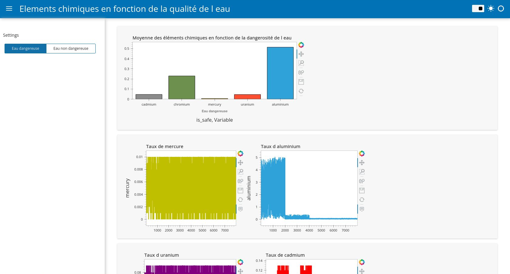

# waterQuality
A project realized during one of my data sciences courses (written in French) , using machine learning algorithms like the K nearest neighbors or logistic regression.
I tried to evaluate which of this algorithms is the best to predict the water quality (dangerous or not) by calculting the errors and the ROC curves of each algorithms.
Then, I created my first interactive visualization dashboard in Python thanks to Panel ! 

I'll take any of your advices to progress.
I'm also currently working on a new project about Youtube API of fitness channels.
